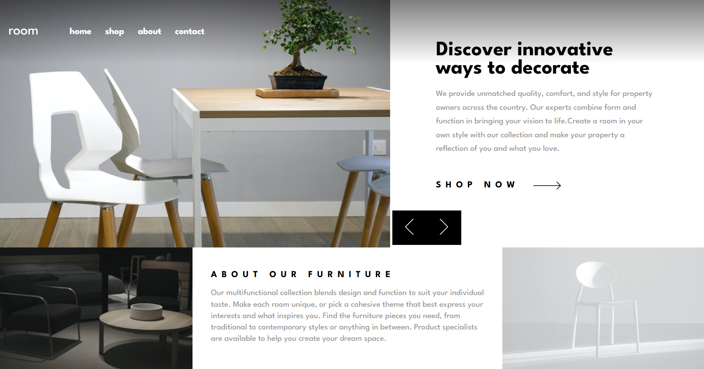

# Frontend Mentor - Room homepage solution

This is a solution to the [Room homepage challenge on Frontend Mentor](https://www.frontendmentor.io/challenges/room-homepage-BtdBY_ENq). Frontend Mentor challenges help you improve your coding skills by building realistic projects. 

## Table of contents

- [Overview](#overview)
  - [The challenge](#the-challenge)
  - [Screenshot](#screenshot)
  - [Links](#links)
- [My process](#my-process)
  - [Built with](#built-with)
  - [What I learned](#what-i-learned)
  - [Continued development](#continued-development)
- [Author](#author)

## Overview

### The challenge

Users should be able to:

- View the optimal layout for the site depending on their device's screen size
- See hover states for all interactive elements on the page
- Navigate the slider using either their mouse/trackpad or keyboard

### Screenshot



### Links

- Solution URL: [github](https://github.com/Diego2Drm/Room-homepage)
- Live Site URL: [Room Homepage](https://diego2d-room-homepage.netlify.app/)

## My process

### Built with

- Semantic HTML5 markup
- CSS custom properties
- Flexbox
- Css Modeule
- Mobile-first workflow
- TypeScript
- [React](https://reactjs.org/) - JS library

### What I learned

Show images in TypeScript for deploy 

```tsx
import arrow from '../../assets/images/icon-arrow.svg'
import mHero1 from '../../assets/images/mobile-image-hero-1.jpg'
import dHero1 from '../../assets/images/desktop-image-hero-1.jpg'
import mHero2 from '../../assets/images/mobile-image-hero-2.jpg'
import dHero2 from '../../assets/images/desktop-image-hero-2.jpg'
import mHero3 from '../../assets/images/mobile-image-hero-3.jpg'
import dHero3 from '../../assets/images/desktop-image-hero-3.jpg'


export type ImageKeys =
  'src/assets/images/mobile-image-hero-1.jpg' |
  'src/assets/images/desktop-image-hero-1.jpg' |
  'src/assets/images/mobile-image-hero-2.jpg' |
  'src/assets/images/desktop-image-hero-2.jpg' |
  'src/assets/images/mobile-image-hero-3.jpg' |
  'src/assets/images/desktop-image-hero-3.jpg';

export interface Data {
  id: number,
  imgMobile: ImageKeys,
  imgDesktop: ImageKeys,
  title: string,
  info: string,
}

  const [dataImages, setDataImages] = useState<Data[]>([])

  useEffect(() => {
    setDataImages(data)
  }, []);

  const imageMap: Record<ImageKeys, string> = {
    'src/assets/images/mobile-image-hero-1.jpg': mHero1,
    'src/assets/images/desktop-image-hero-1.jpg': dHero1,
    'src/assets/images/mobile-image-hero-2.jpg': mHero2,
    'src/assets/images/desktop-image-hero-2.jpg': dHero2,
    'src/assets/images/mobile-image-hero-3.jpg': mHero3,
    'src/assets/images/desktop-image-hero-3.jpg': dHero3,
  }

<figure className={style.contentImg}>
  
  
</figure>
```

### Continued development

- TypeScript

## Author

- Frontend Mentor - [@Diego2Drm](https://www.frontendmentor.io/profile/Diego2Drm)
- Gmail - [diego.ramirez2d03@gmail.com]